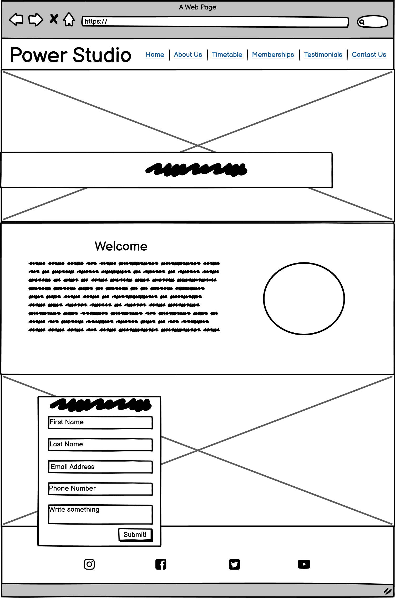
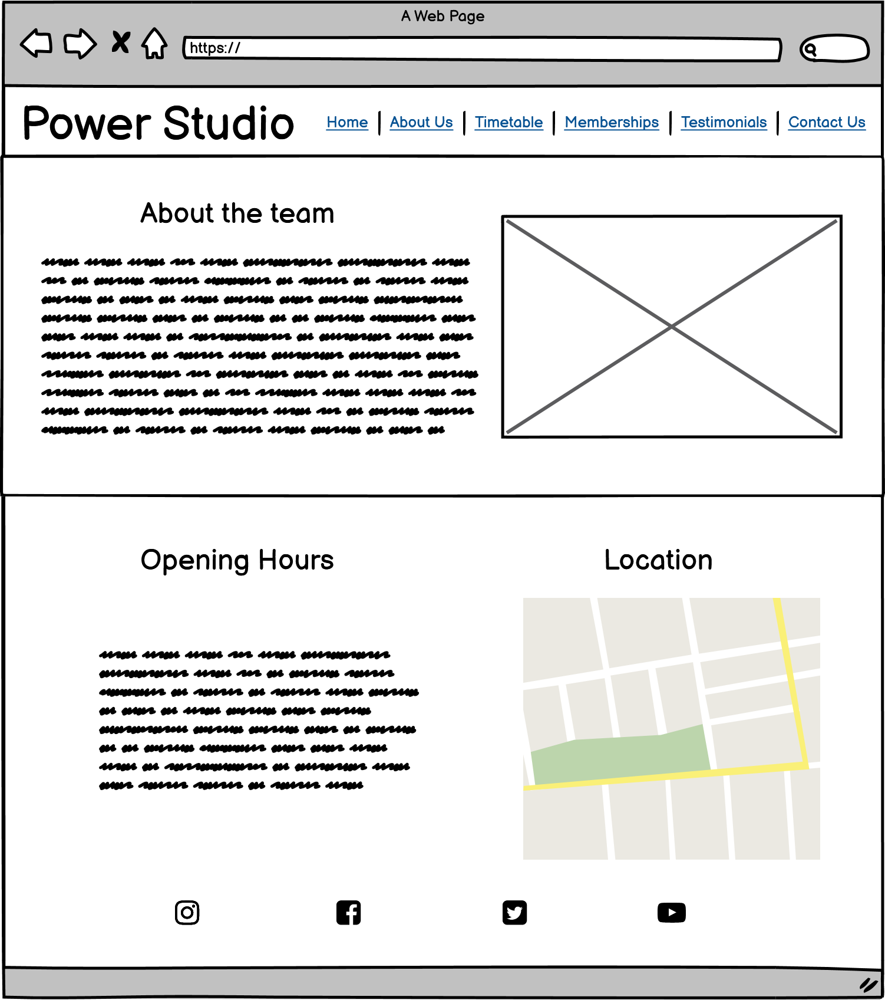
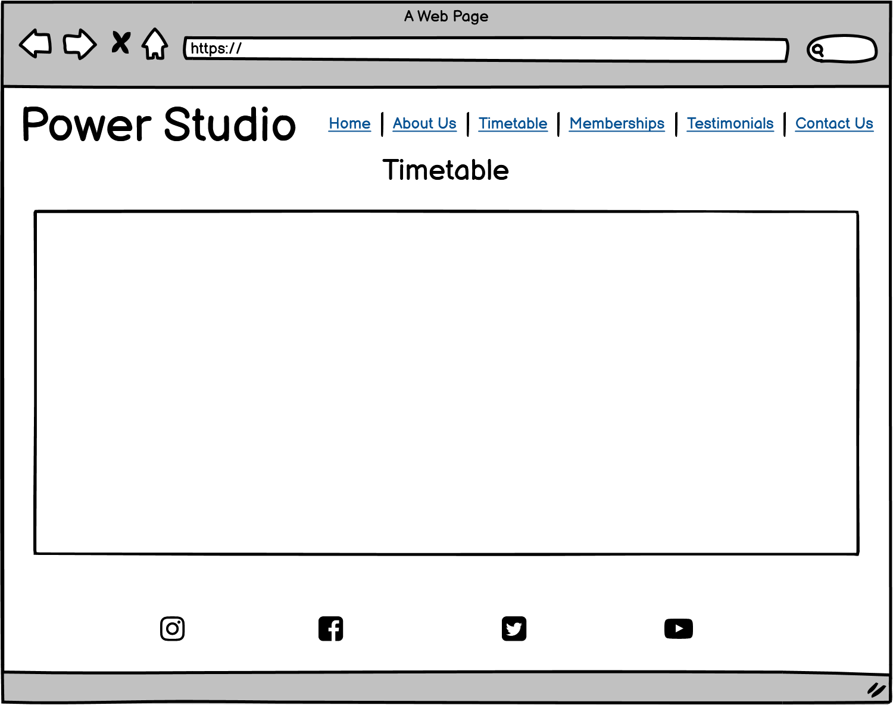
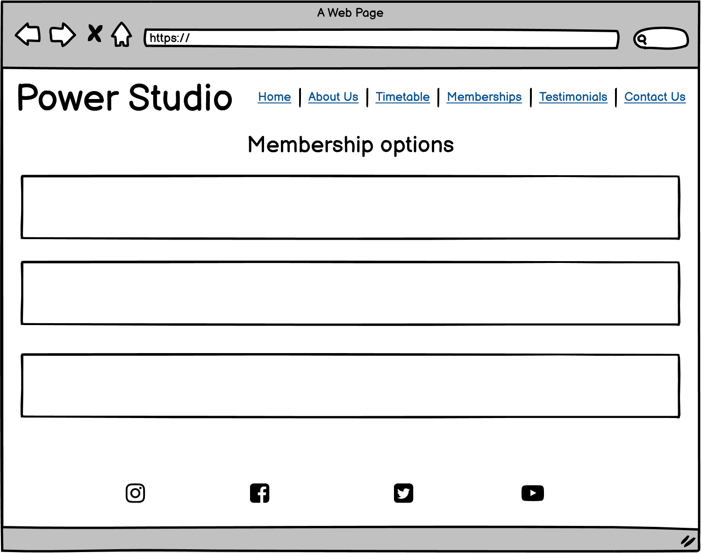
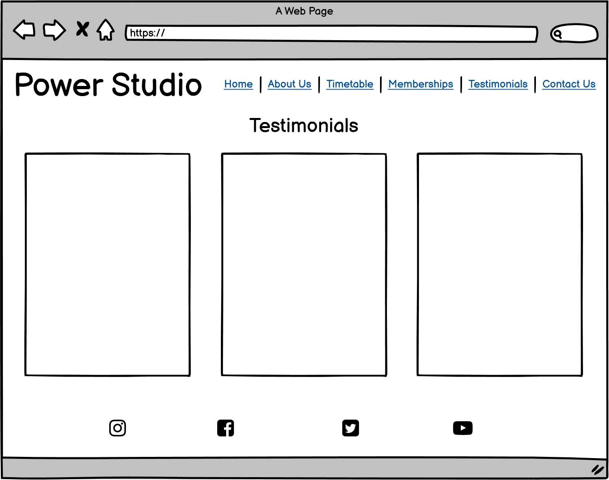
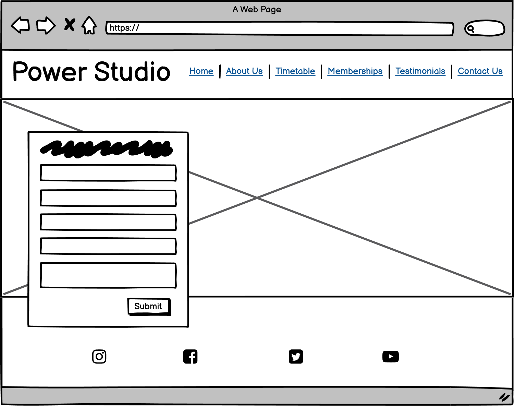
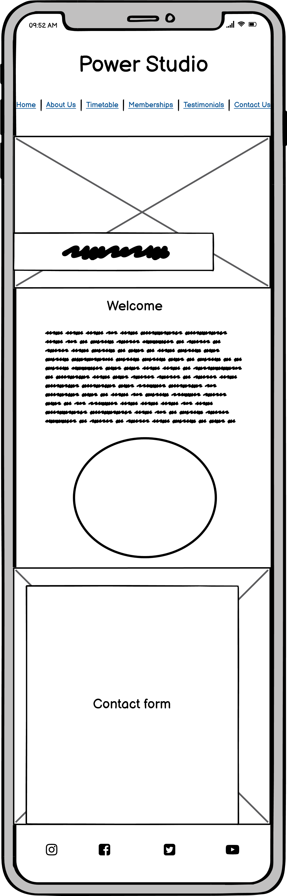
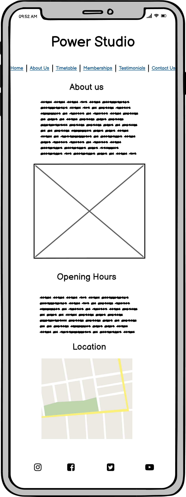
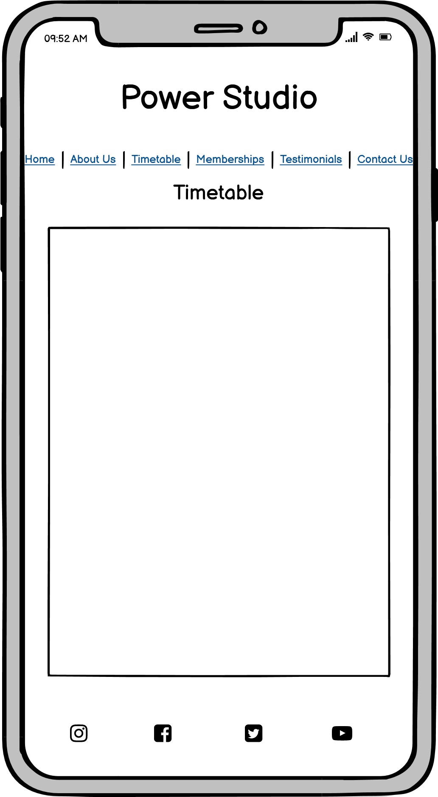
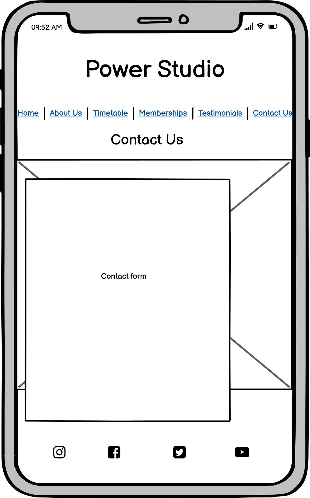

#  **POWER STUDIO** 
As part of the Diploma in Software Development run by Code Institute that I am completing with UCD Professional Acadamey, I must complete five portfolio projects. This is the first portfolio project and the focus of this project is to show my ability to use HTML and CSS.

## User Experience (UX)

### User Stories:

* As a user, I would like to be able to easily navigate through the webpage.
* As a user, I would like to see motivating imagery to join the studio.
* As a user, I would like to be able to see what classes are on and when.
* As a user, I would like to be able to easily contact the owners for more information.
* As a user, I would like to know where the studio is located.
* As a user, I would like to know the qualifications of the team that run the studio.
* As a user, I would like to know other peoples' experience of the studio.
* As a user, I would like to know what my payment options are.
* As a user, I would like to easily find the information I am looking for.
* As a user, I would like to find their social pages.

## Design

### Colours:

The three main colours I used are:
*  `#11151c`
*  `#efaac4`
*  `#602f5e`

I used these colours as they are easy to read together, are feminine for a women's studio and are eye catching.

### Typography

### Structure

The site will consist of 6 main pages; Home, About Us, Timetable, Memberships, Testimonials and Contact, Us. 

Desktop Wireframes

 

Mobile Wireframes

 

## Features

* Logo 

    The Logo is a bright color to attract the eye easily and is clickable to bring you back to the index.html page.

* Navigation Menu

    All links bring you to a seperate section on the page besides the contact button which will redirect you to the contact.html page

* Footer 

    Includes a contact form and social media links

* Home Page Features
    
    The homepage has a short piece of information of the studio, a timetable, shows the different membership options, testimonials from three girls, opening hours, and a map of where the studio is.

## Testing

While making this project I ended up disliking my original idea, so that is why my project now looks different to the wireframes that were made. I found the original idea how too much free white space so ended up changing the project.

## Deployment

## Credits

* A lot of the code is based of the Code Institute Love running project.
* All images were downloaded from Unsplash.
* Color scheme was decided on using Coolors.
* Placeholder was used to add colors to this file.

## Technologies Used

* HTML
* CSS

### Acknowledgements

* I got most of my help from W3schools and Stack Overflow.

